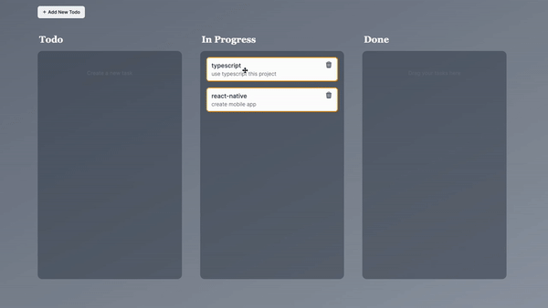

# Drag and Drop TODO Application

This project is a drag and drop TODO application built using Next.js and
Zustand. The application allows users to easily create and organize their tasks.

## Features

- **Drag and Drop**: Easily rearrange tasks by dragging and dropping them.
- **State Management with Zustand**: Manage the application's state efficiently
  using Zustand.
- **TypeScript Support**: Built with TypeScript for type safety and improved
  developer experience.
- **Radix UI Components**: Utilizes Radix UI components for a polished and
  accessible UI.
- **Tailwind CSS**: Styled using Tailwind CSS for quick and responsive design.

## Getting Started

To get a local copy up and running, follow these simple steps.

### Prerequisites

Make sure you have the following installed:

- Node.js
- npm or pnpm

### Installation

1. Clone the repo
   ```sh
   git clone https://github.com/your-username/next-zustand-todo.git
   ```

### Install NPM packages

npm install or pnpm install

## Usage

To start the development server, run:

npm run dev or pnpm dev

Open http://localhost:3000 with your browser to see the result.


